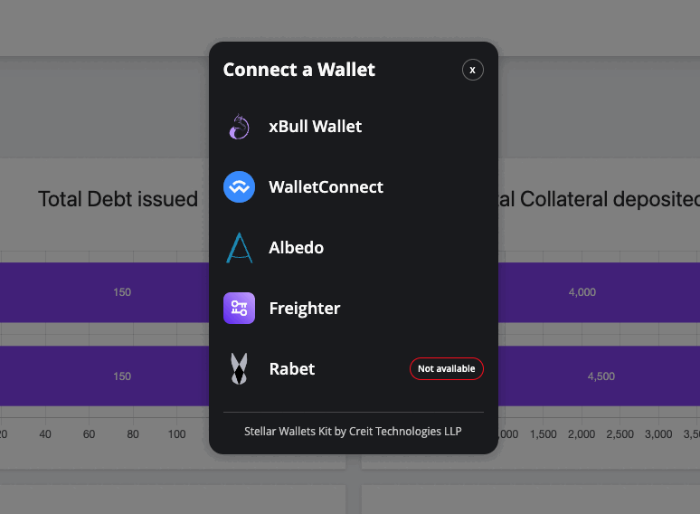
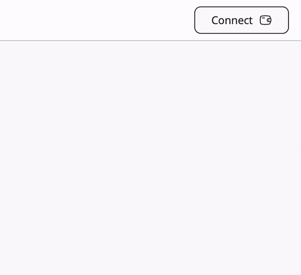

A kit to handle all Stellar Wallets at once with a simple API and without caring about individual configurations for each one of them. This library cares only about the connection and interaction with the wallets, allowing developers handling the UI/UX in the way they want.

## Compatible Wallets:

- xBull Wallet (Both PWA and extension version)
- Albedo
- Freighter
- Rabet (extension version)
- WalletConnect
- Lobstr
- Hana
- Hot Wallet
- Klever Wallet

## Installation

```shell
npm i @creit.tech/stellar-wallets-kit
```

## Who is using the kit?

If you would like to see the kit in action, check these websites that are already using it:

- https://lab.stellar.org/
- https://swap.xbull.app/
- https://mainnet.blend.capital/
- https://app.fxdao.io/
- https://app.sorobandomains.org/
- https://stellar.cables.finance/

## The StellarWalletsKit class

The first step will be creating a new instance from the main class, you should only create one instance in order to avoid unexpected results.

```typescript
import {
  StellarWalletsKit,
  WalletNetwork,
  allowAllModules,
  XBULL_ID
} from '@creit.tech/stellar-wallets-kit';

const kit: StellarWalletsKit = new StellarWalletsKit({
  network: WalletNetwork.TESTNET,
  selectedWalletId: XBULL_ID,
  modules: allowAllModules(),
});
```

> The `allowAllModules()` function doesn't import those modules where you need to provide a configuration (like WalletConnect), you will need to add them manually so check the folder `src/modules` to know all the available modules. 

If you want to specify only the wallets you want to support, you can start the kit with only those by sending the modules to the constructor like this:

```typescript
import {
  FreighterModule,
  StellarWalletsKit,
  WalletNetwork,
  XBULL_ID,
  xBullModule
} from '@creit.tech/stellar-wallets-kit';

const kit: StellarWalletsKit = new StellarWalletsKit({
  network: WalletNetwork.TESTNET,
  selectedWalletId: XBULL_ID,
  modules: [
    new xBullModule(),
    new FreighterModule(),
  ]
});
```

The available modules and their identifier are : 
| Wallet | Module class | identifier |
| - | - | - |
| Albedo | AlbedoModule | ALBEDO_ID |
| Freigther | FreighterModule | FREIGHTER_ID |
| Hana | HanaModule | HANA_ID |
| Ledger Wallet | LedgerModule | LEDGER_ID |
| Trezor Wallet | TrezorModule | TREZOR_ID |
| Lobstr | LobstrModule | LOBSTR_ID |
| Rabet | RabetModule | RABET_ID |
| Wallet connect | WalletConnectModule | WALLET_CONNECT_ID |
| xBull | xBullModule | XBULL_ID |
| HOT Wallet | HotWalletModule | HOTWALLET_ID |
| Klever Wallet | KleverModule | KLEVER_ID |


## Integrated UI Modal



The library integrates a UI modal you can show your users after you have started the kit. Once they pick the wallet they want to use you can then use the other methods available. Here is how you can use it:
```typescript
await kit.openModal({
  onWalletSelected: async (option: ISupportedWallet) => {
    kit.setWallet(option.id);
    const { address } = await kit.getAddress();
    // Do something else
  }
});
```

And as simple as that you will give full support to all the Stellar wallets plus you don't even need to handle the modal UI yourself. 

The `openModal` method also lets you update multiple things about the model like the title, the allowed wallets or even the styles of it! Here are the accepted parameters:

```typescript
function openModal(params: {
    onWalletSelected: (option: ISupportedWallet) => void;
    onClosed?: (err: Error) => void;
    modalTitle?: string;
    notAvailableText?: string;
}) {}
```

## Integrated UI Button



Just like with the built-in modal component, the kit also includes a `Button` component that helps you to show an easy-to-use interface to your users so they can connect/disconnect their wallet while your site gets updates for when that happens. Here is how you can use it:

```typescript
await kit.createButton({
  container: document.querySelector('#containerDiv'),
  onConnect: ({ address}) => {
    // Do something when the user "connects" the wallet, like fetching the account data
  },
  onDisconnect: () => {
    // Do something when the user "disconnects" the wallet, like clearing all site data and reload
  }
})
```

With just that you will include an interactive button on your website that will show the built-in modal to the user, fetch the public key, fetch the current XLM balance (if you provide a horizon URL), and give the user a UI to use!.

You can see all the parameters you can include:
```typescript
function createButton(params: {
    container: HTMLElement;
    onConnect: (response: { address: string }) => void;
    onDisconnect: () => void;
    horizonUrl?: string;
    buttonText?: string;
}): Promise<void> {}
```

## Request the public key and sign transactions

Each wallet has its own way when it comes to both requesting the public key and signing a transaction. Using this kit you can do both actions with a unified API:
```typescript
const { address } = await kit.getAddress();
// AND THEN
const { signedTxXdr } = await kit.signTransaction('XDR_HERE', {
  address,
  networkPassphrase: WalletNetwork.PUBLIC
});
```

Both methods will trigger the action using the wallet you have set before calling those methods.
 
## Extra methods

There will be moments where you would like to change certain parameters from the kit like the selected wallet, the network, etc... or maybe listening when a WalletConnect session was removed. These methods will help you in those situations: 

### Set the target wallet

```typescript
await kit.setWallet(XBULL_ID)
```

And more methods, check the documentation to see all the methods available.

## License


Licensed under the MIT License, Copyright © 2023-present Creit Technologies LLP.

Checkout the `LICENSE.md` file for more details.


